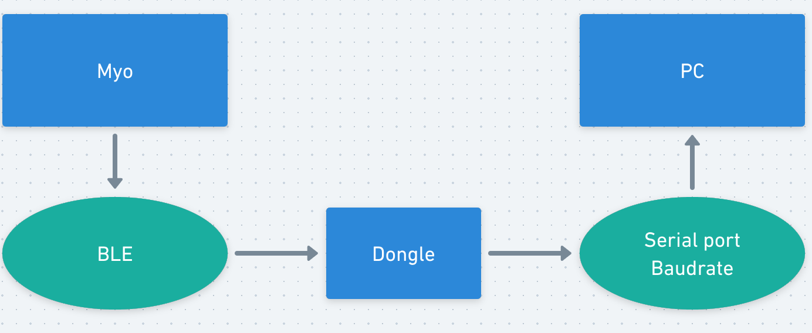

# Debug EMG Data Transfer Rate

#### Problem solved (only one Myo tested):

The solution code (add `myo_lib.py` and `common.py`) is adapted from `myo_raw` repo:https://github.com/dzhu/myo-raw. However, this version did not subscribe **4 EMG  characteristics**, so have to take care of them in handle_data():

```
# Read notification handles corresponding to the for EMG characteristics
elif attr == 0x2b or attr == 0x2e or attr == 0x31 or attr == 0x34:
     '''According to http://developerblog.myo.com/myocraft-emg-in-the-bluetooth-protocol/
     each characteristic sends two secuential readings in each update,
     so the received payload is split in two samples. According to the
     Myo BLE specification, the data type of the EMG samples is int8_t.
     '''
     emg1 = struct.unpack('<8b', pay[:8])
     emg2 = struct.unpack('<8b', pay[8:])
     self.on_emg(emg1, 0)
     self.on_emg(emg2, 0)
```

This also notified that the problem that our EMG data is not published at 200 Hz is because we have to split the received playload from each characteristic into two emg data and **publish them separately and sequentially in one handling!**


#### In Ros node: (adjust Ros rate or baudrate)


For two Myos one dongle,  the two Myos will publish two EMG data together through serial port, but each EMG data will be published by separate Ros topic, the test is based on the individual of each EMG data.

Set the condition for publish EMG data only when its value (getting from myo) changes:

```
if (self.last_emg is None \ or 
	(not self.last_emg[0] == self.emg_val[0] and 
	not self.last_emg[1] == self.emg_val[1])) \
	and self.emg_val is not None:
```

By then, only get EMG topic published by Ros node limited at **85 Hz** even set very high rate in ROS

Change baudrate from 1200 to 115200 does impact the emg data rate (theoretically should matter but maybe the transfered data is compressed)

So narrow down the issue (EMG data not reaches 200Hz) to the Myo device driver end 

#### In Myo driver: (adjust baudrate)

the process how EMG data transfer from Myo device to PC:



The timer I set in order to measure the EMG data publish rate is inside the handle_emg() function, so that it can reflect the frequency that bluetooth event handler (handle_attribute_value)  sends the EMG data (emg_val) 

##### Test serial port baudrate:

​	For one Myo one Dongle: 130 Hz, baudrate will not affect

​	For two Myo one Dongle: 260 Hz,    (Ros topic)  100Hz and 85Hz,   baudrate will not affect


Discussion:

1. in Ros node, is better to publish the EMG topic when the EMG data from two myos different or just one of them different?  
   1. even the rate pub by two myo at 260 Hz does not match Ros pub rate at 85Hz
   2. after decouple two topic: limited to 100Hz and 85Hz 
2. Is it the right way to change the baudrate?
3. it is a way to adjust the handler trigger freq or myo emg data pub freq?

